 

&nbsp;&nbsp;

 

<i>“It’s not about whether I can or not. I’m gonna do it because I want to.”</i>
 
- Mugiwara Luffy

 

<a href="https://www.linkedin.com/in/nishanth-sr" target="_blank">LinkedIn</a> &nbsp;·&nbsp;
<a href="https://www.instagram.com/_ns_nishanth_?igsi=cmV2Y3EyYzQwcDVi" target="_blank">Instagram</a> &nbsp;·&nbsp;
<a href="https://mail.google.com/mail/?view=cm&amp;fs=1&amp;to=nishanth.sr.7@gmail.com" target="_blank">Email</a>

 

